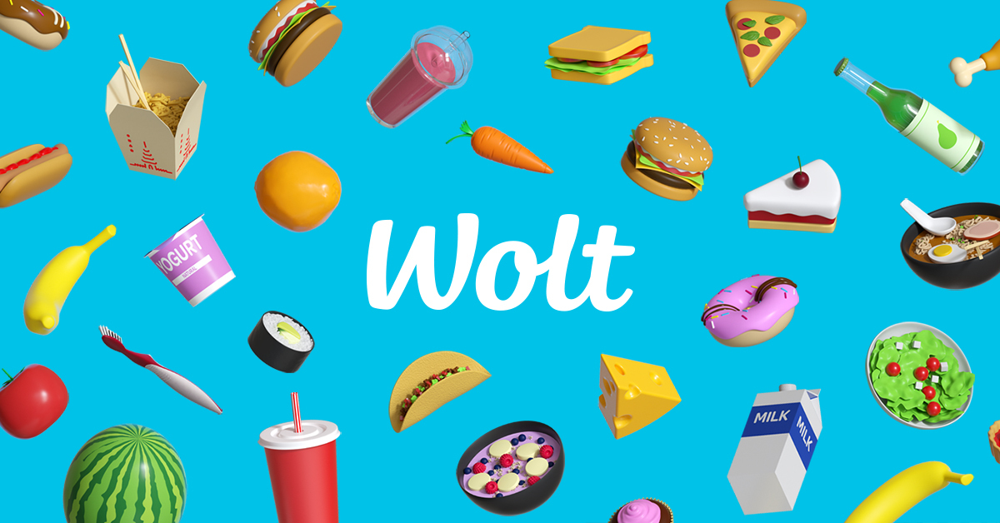
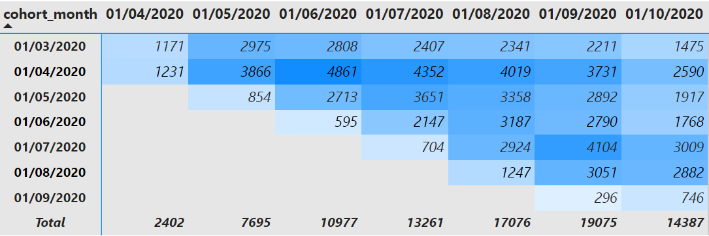
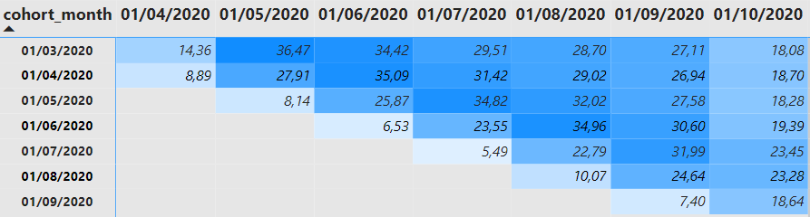
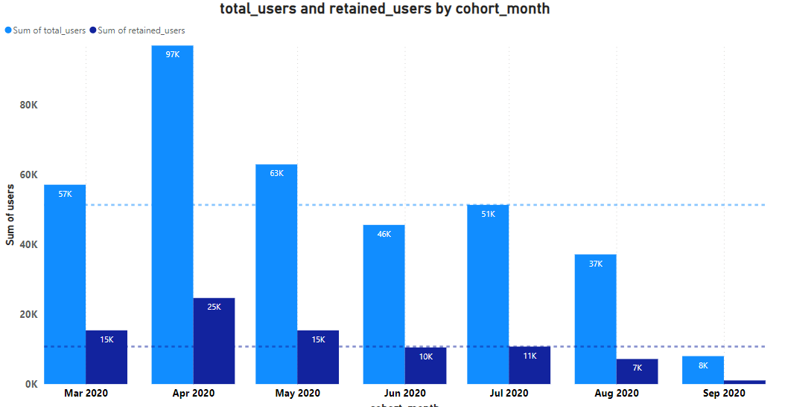

# Background
This case study is doneon wolt a leading platform that's makes it easy for customers to order whatever they need on one app, for merchants to make additional sales, and for couriers to make meaningful earnings flexibly.
- The data is an artificial dataset that could be produced by wolt purchase process, where a user makes their first and possibly following purchases from Wolt.  
- Wolt has separated these purchases into two files, the first one containing only the users’ first ever purchases from Wolt **first_purchases**, and the second one containing all purchases from these users **purchases**.

# Project overview
The project task is to see how well Wolt manages to retain its customers month afeter month based on when users made their first ever purchase.
- Cohort based monthly retention for Retail product line.
- Cohort based monthly retention for Restaurant product line
I have used PostgreSQL with pgAdmin to solve the problem and Power BI for visualizations

# Data Dictionary
The dataset includes the following columns with their descriptions:
### first purchases
| Coloum                        | Description                                            |
|-------------------------------|--------------------------------------------------------|
| First Purchase Date           | Date (UTC) when a user did their first Wolt purchase.  |
| First Purchase Product Line   | Product line of the first purchase: 'Restaurant' or 'Retail store'. |
| User ID                       | Unique ID of the user who made the first purchase.      |
| Purchase ID                   | Unique ID of the purchase.                              |
| Venue ID                      | Unique ID of the venue where the purchase was made.     |

### purchases

|  Coloum               | Description                                        |
|-----------------------|----------------------------------------------------|
| Purchase Date         | Date (UTC) of the purchase.                         |
| Product Line          | Product line of the purchase: 'Restaurant' or 'Retail store'. |
| User ID               | Unique ID of the user who made the purchase.         |
| Purchase ID           | Unique ID of the purchase.                           |
| Venue ID              | Unique ID of the venue where the purchase was made.  |

# Technologies Used:
- PostgreSQL
- Power BI
I am going to use PostgreSQL to solve the problem and calculate the cohort based monthaly retention for Retal and Restaurant, and then use Power BI for visualizations. 
The hole process can be done in Power BI but they asked to use SQL and any other tool for visualizations.

# Conclusion 
### Findings:
Below figure shows the result for **Restaurant** product line. 

